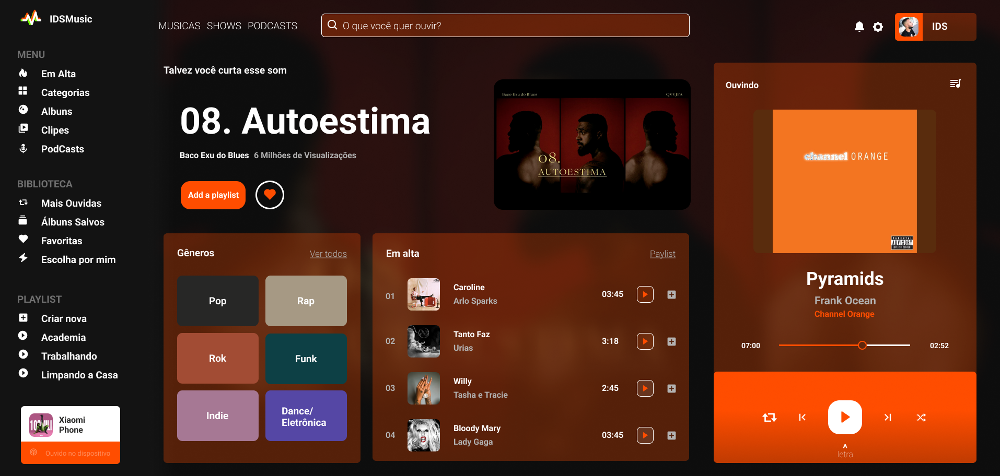

Este é um projeto de website de música responsivo no qual me inspirei para praticar e aprofundar meus conhecimentos em desenvolvimento web. O tutorial do YouTube ([disponível aqui](https://youtu.be/Fwyo1AqvzM4)) utiliza modernas técnicas de HTML e CSS para criar um Design de Aplicativo de Música totalmente responsivo, acompanhado de um tema de cores impressionante. Algumas das técnicas abordadas no tutorial incluem:

# CSS Flexbox: Utilizado para criar layouts flexíveis e responsivos.
# Media Queries: Implementadas para garantir que o design se adapte a diferentes tamanhos de tela.
# Transições CSS: Adicionadas para criar efeitos de animação suaves e interativos.
# Prototipação no Figma: Ferramenta utilizada para criar protótipos visuais e planejar o design antes da implementação.
